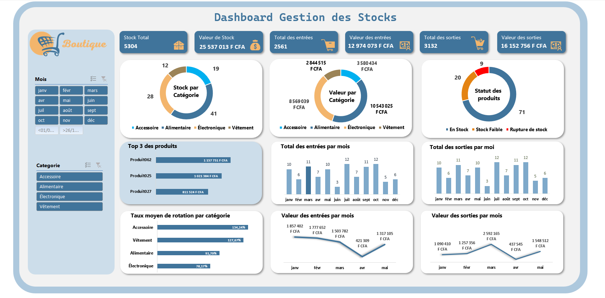
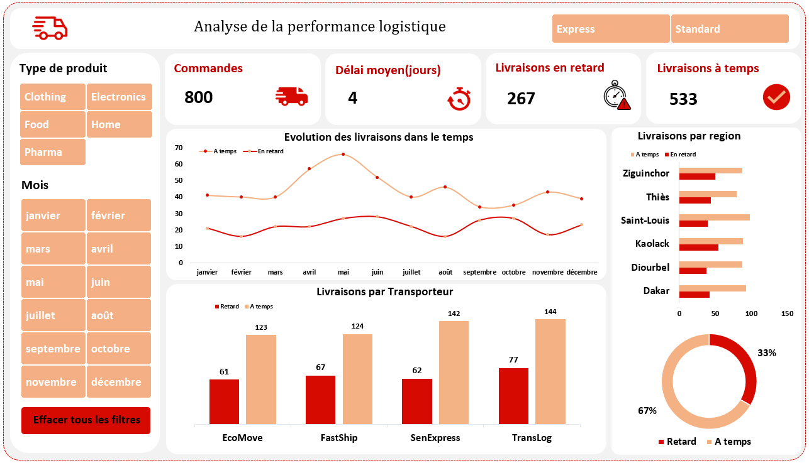
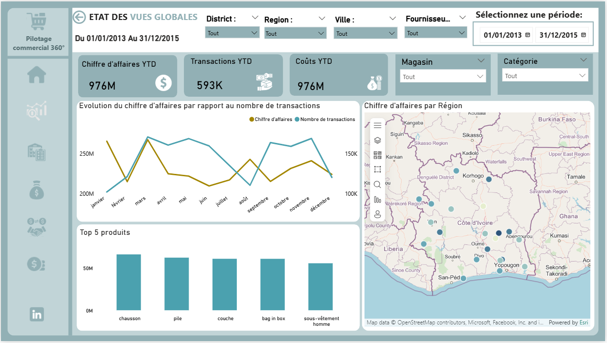
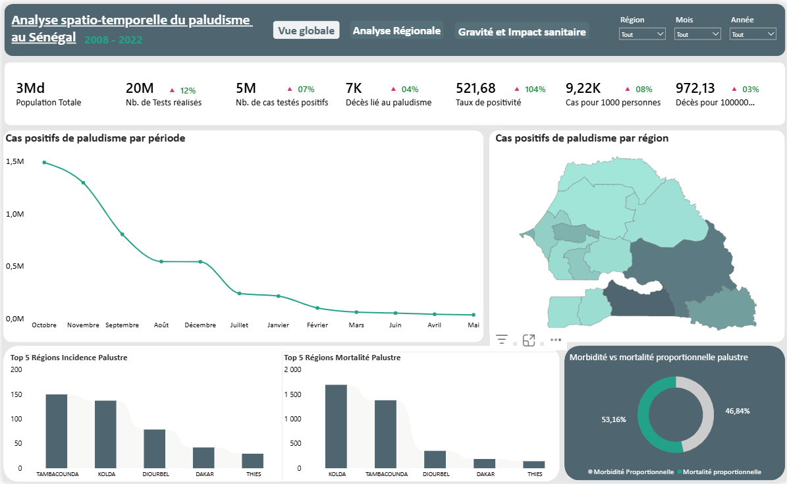
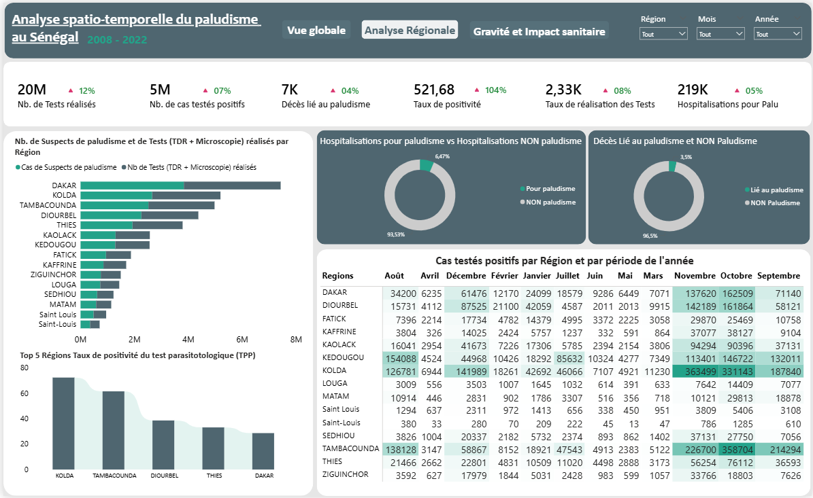
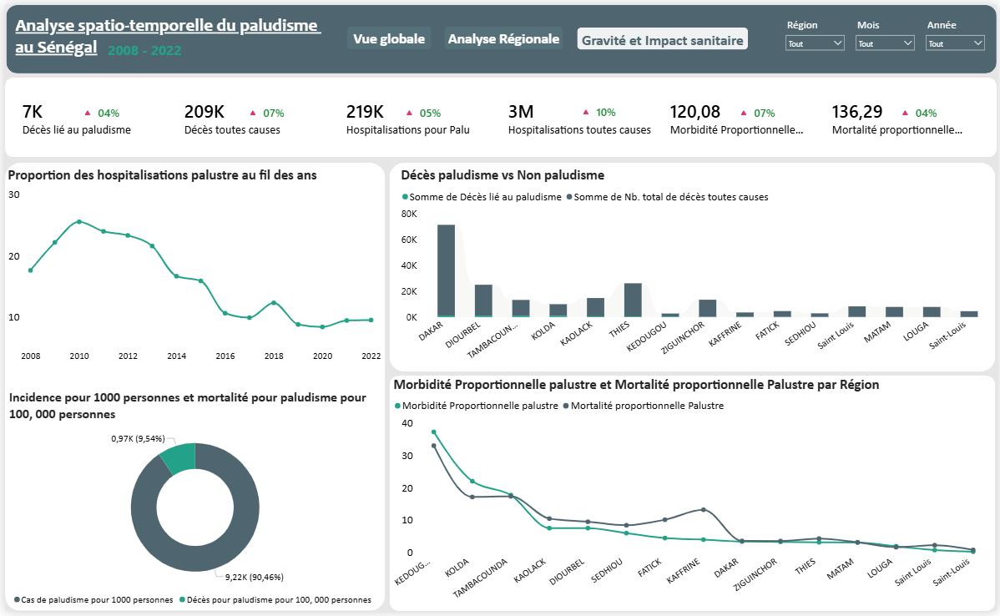
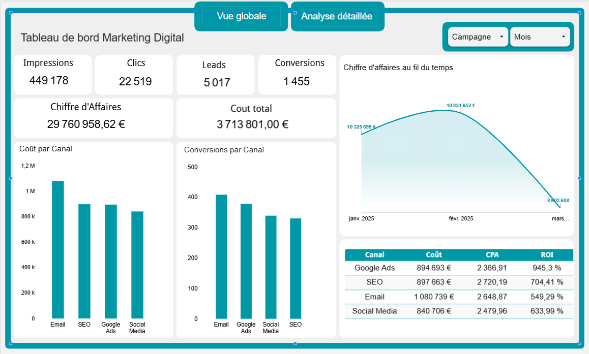
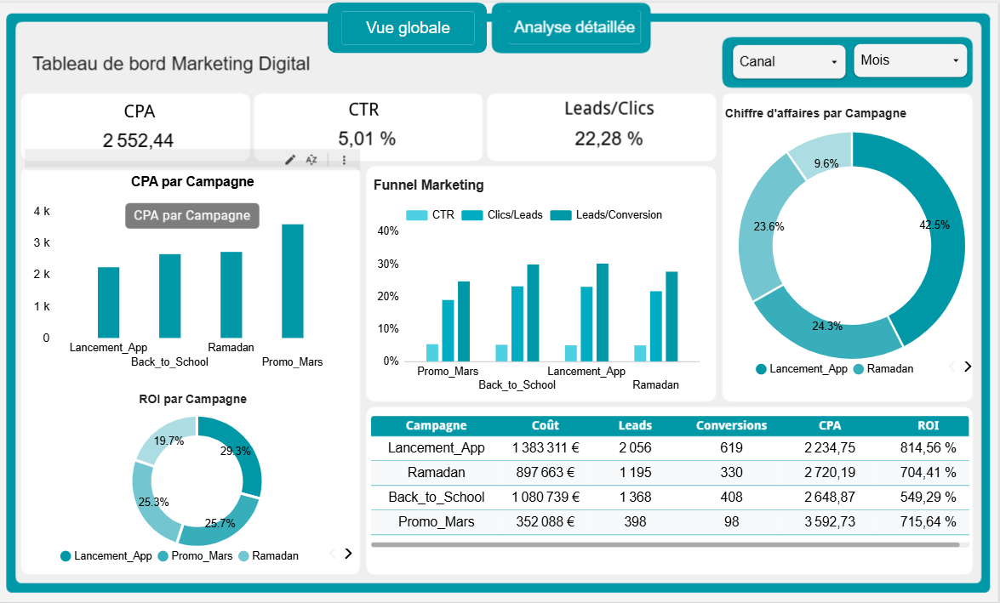
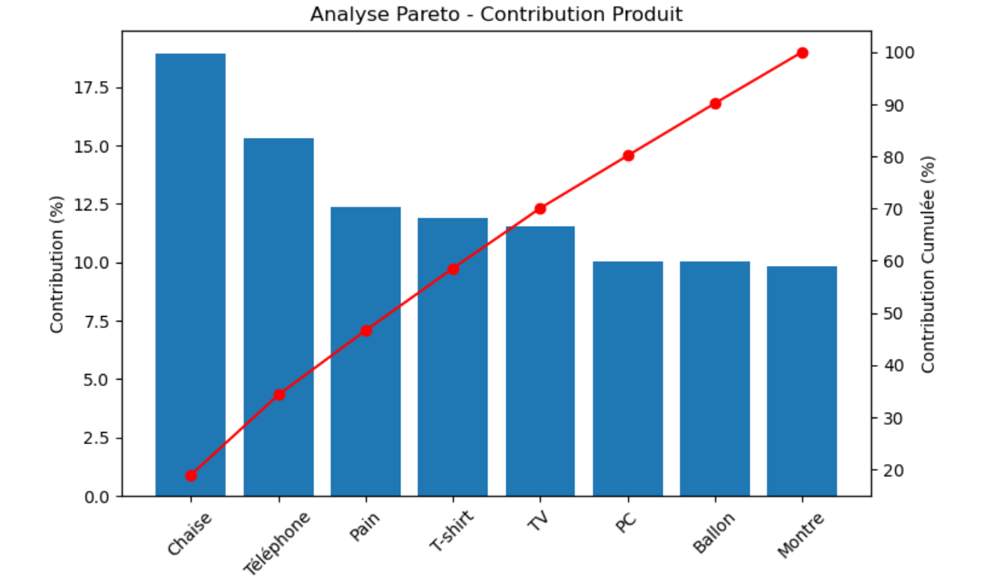
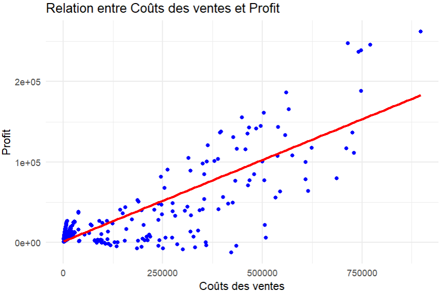

# Portfolio – Coumba Amidou BA

Bienvenue sur mon portfolio de projets en **Data Analysis** 👋🏽  
Je suis **Data Analyst**, passionnée par la **Business Intelligence** et la **valorisation des données**.

---

## Dashboard – Gestion des Stocks (Excel)

**Objectif :** Suivre les entrées, sorties et ruptures de stock.  
**Outils :** Excel (TCD, graphiques dynamiques, segments)  
**Résultats :** Indicateurs clés – stock total, top produits, alertes de rupture.  
 
**Vidéo de démonstration :** cliquez sur l’image ci-dessous 👇🏽  

---

## Dashboard – Analyse de la performance logistique (Excel)

**Objectif :** Analyser les livraisons et identifier les facteurs qui impactent la ponctualité.  
**Outils :** Excel (TCD, graphiques dynamiques, segments)  
**Résultats :** Indicateurs clés – taux à temps vs retard, délais moyens, performance par transporteur et région, et tendances mensuelles. 

---

## Dashboard – Pilotage Commercial (Power BI)

**Objectif :** Analyser les ventes, coûts et marges pour une entreprise fictive.  
**Outils :** Power BI, DAX, modélisation relationnelle.  
**Résultats :** Tableaux de bord interactifs par période, produit et région.  

---
## Dashboard – Analyse spatio-temporelle du paludisme au Sénégal  (Power BI)

**Objectif :** analyser l’évolution de la maladie et mieux comprendre ses dynamiques à travers des indicateurs clés de santé publique.  
**Outils :** Power BI, DAX.   
**Le dashboard met en évidence :**
- l’évolution des cas dans le temps (tendances, saisonnalité)
- la répartition géographique par région
- les indicateurs clés (cas positifs, hospitalisations, taux de positivité, mortalité)
- les variations annuelles (hausse / baisse)
- les zones les plus touchées via une analyse cartographique.
**Résultats :** Tableaux de bord interactifs par region, produit et région. 

  
**Vue globale**

**Analyse régionale**

**Gravité et impact sanitaire**

---
## Dashboard – Marketing Digital (Looker Studio)

**Objectif :**   Transformer les données marketing en décisions actionnables.
**Outils :** Looker Studio
**Résultats :** Tableaux de bord interactifs avec:
le funnel de conversion (CTR → Clics → Leads → Conversions)

la performance des campagnes

le ROI et le CPA pour piloter la rentabilité

**Vue globale**

**Analyse detaillée**

---

## Analyse Business des Performances Commerciales (Python)
**Objectif :** Identifier les leviers clés de performance à partir de données de ventes (produits, clients, régions).
**Outils :** Python, Pandas, Matplotlib.
**Résultats :**

Analyse de la contribution produit et application du principe de Pareto (80/20).

Identification d’une concentration du chiffre d’affaires sur un nombre limité de clients.

Mise en évidence des disparités régionales et des axes d’optimisation commerciale.

Production de visualisations claires pour appuyer la prise de décision.

### Aperçu du projet

### 📂 Fichiers du projet

- 📓 Notebook interactif : [Voir le notebook](Analyse_business.ipynb)
- 📑 Version PDF : [Télécharger le rapport](Analyse_business (1).pdf)

---
## Analyse Financière & Modélisation Prédictive (Language R)

**Objectif :**
Réaliser une analyse financière complète afin de comprendre les relations entre les ventes, les coûts et la rentabilité, puis construire un modèle de régression pour prédire la performance financière.

**Démarche :**

Analyse exploratoire des données (EDA)

Nettoyage et préparation des données

Analyse unidimensionnelle et bidimensionnelle

Vérification des hypothèses du modèle linéaire

Modélisation par régression linéaire

Interprétation économique des résultats
**Résultats :**
L’analyse a permis d’identifier plusieurs relations économiques importantes entre les variables financières.
Le modèle de régression met en évidence une capacité explicative limitée, révélant la complexité du phénomène étudié et ouvrant la voie à des approches de modélisation plus avancées.

### Aperçu du projet

### 📂 Fichier du projet

- 📓 Fichier R: [Voir le fichier](projet1.R)

---
## 📈 Traitement de données avec Apache Spark
Manipulation et transformation de datasets avec Scala

Génération et export de données en JSON

Utilisation de Spark SQL et DataFrame API

Exécution en environnement local (Windows + Hadoop

### 📂 Fichiers du projet

- 📓 Code : [Voir le code](DeckProject.scala)
- 📑 Base : [Télécharger la base de données](Deckofcards.txt)

---

## Compétences techniques
- Power BI (DAX, modélisation, reporting interactif)  
- Excel (TCD, Power Query, automatisation)  
- SQL (requêtes, jointures)  
- Python (pandas, numpy, matplotlib)  
- R (analyse, visualisation)

---

## 📫 Contact
**Coumba Amidou BA**  
📧 bcoumba221@gmail.com  
📱 +221 78 130 24 54  
🌍 [LinkedIn]([www.linkedin.com/in/coumba-amidou-ba-a96465241](https://www.linkedin.com/in/coumba-amidou-ba-a96465241?utm_source=share_via&utm_content=profile&utm_medium=member_ios))
